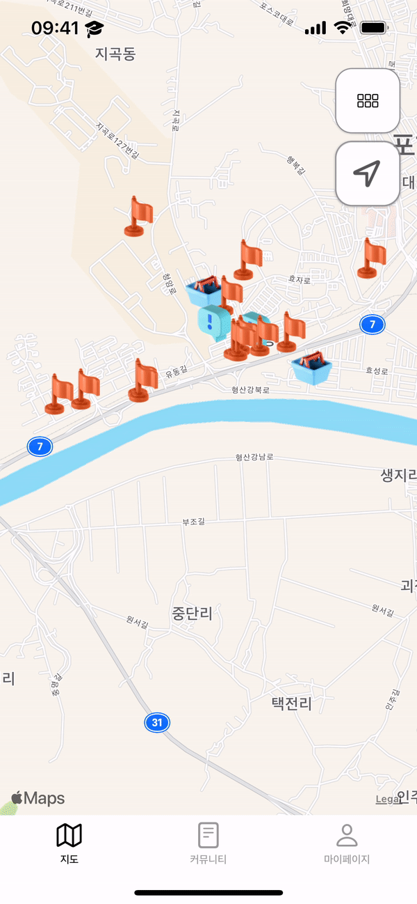
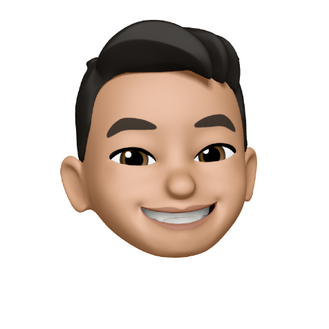

# 🙌🏻 Haro 

<div align="center">
    


<br>
<br>

📆 **2022. 03. 21. ~ 2022. 04. 15.**
    
[](https://developer.apple.com/kr/swift/) [](https://developer.apple.com/kr/xcode/)

[📜 BackLog ➡️](https://docs.google.com/spreadsheets/d/1NG3ONCIkoRuogH0pDeNI2IVEOkUw63E5Dq4uSqPcsCE/edit?usp=sharing)

</div>

<br>
<br>

## 👀 Preview

- A hyperlocal community app for quick and easy access to information on the local area

||||
|:-:|:-:|:-:|
|`Log in`|`Map`|`Story`|
||||
|`Category`|`Meeting`|`Community`|


<br>
<br>

## 👨🏻‍💻👩🏻‍💻👩🏻‍🎨 Team 

<div align = "center">

|Designer|Developer|Developer|Developer|Developer
|:-:|:-:|:-:|:-:|:-:|
||||||
|Gani|Min|Rey|Smile|Zero|
    
</div>

<br>
<br>


## 📝 Project Goal

    
➡️ Extension of Access to Information
    
➡️ Create different forms of information that fit when and where you are
    
➡️ A hyperlocal community app for quick and easy access to information on the local area

<br>
<br>

## 🛠 Developement Environment

|Environment|Version|
|:-:|:-:|
|Swift|5.6|
|Xcode|13.3|
|iOS Deployment Target|15.0|

<br>
<br>


## 🐈‍⬛ Git

### 1️⃣ Git branching Strategy

- Origin(main branch)
    - Origin(dev branch)
        - Local(feature branch)

- Branch
    - Main
    - Dev
    - Feature
    - Fix

- 방법
    - 1. Pull the **Dev** branch of the Origin
    - 2. Make a **Feature** branch in the Local area
    - 3. Developed by **Feature** branch
    - 4. Push the **Feature** from Local to Origin
    - 5. Send a pull request from the origin's **Feature** to the Origin's **Dev**
    - 6. In Origin **Dev**, resolve conflict and merge
    - 7. Fetch and rebase Origin **Dev** from Local **Dev**

<br>

### 2️⃣ Commit convention

|Tag|For|
|:-:|:-:|
|[Feat]|develop feature|
|[Fix]|fix bug|
|[Docs]|modify document|
|[Refactor]|code refactoring|
|[Test]|test code|
|[Comment]|add comment|
|[Setting]|change project settings|

<br>

- Commit message in Korean
- Write issue num after '#' 

<br>

 - ex) [Feat] #11 : 커뮤니티 화면 UI 작성

<br>

### 3️⃣ gitignore

- .DS_Store
- xcuserdata/

<br>
<br>

## ⌨️ Code convention

- Variable Name
    - lowerCamelCase

- Function Name
    - lowerCamelCase

- Abbreviations must be capitalized
    - ex) url (x), URL (O)
    - When an abbreviation begins, it is written in lowercase, otherwise it is always written in uppercase
 
- Stuct, Class
    - Name should be UpperCamelCased
    - All explicit self

- if, if else

```swift
if {

} else {

}
```
 
- argument

```swift
func abcdef(A: Int, B: Int)

.background(.regularMaterial, ABCDE)
.clipShape(RoundedRectangle(cornerRadius: 20),
                            ABCDE)

abcdef(A: Int(10),
       B: 100)

abcdef(A: 10, B: 100)
```

- trnary operator
 
```swift
Bool ? A : B
```

<br>
<br>

## 🏃🏻‍♂️ Sprint


- Period
    - 3 days

- Method
    - Scrum
        - 1 session per day
        - Merge together

    - Development
        - Pair if needed

    - Retropect
        - Lesson run by sprint unit
